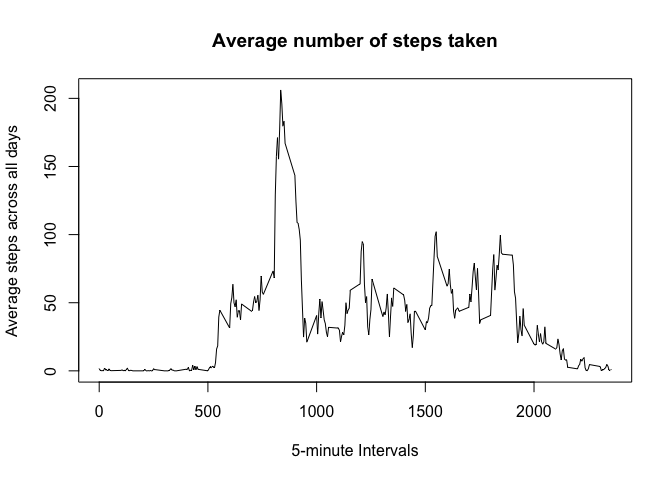

# Reproducible Research: Peer Assessment 1


## Loading and preprocessing the data

1. Load the data

```r
if(!file.exists("activity.csv")){
        unzip("activity.zip")
        }
data <- read.csv("activity.csv")
```

2. Process/transform the data (if necessary) into a format suitable for your analysis


```r
data$date <- as.Date(data$date, "%Y-%m-%d")
```

## What is mean total number of steps taken per day?

1. Calculate the total number of steps taken per day

```r
StepsTotal <- aggregate(steps ~ date, data = data, sum, na.rm = TRUE)
```

2. Make a histogram of the total number of steps taken each day

```r
hist(StepsTotal$steps, main = "Total steps by day", xlab = "day", col = "red")
```

 

3. Calculate and report the mean and median of the total number of steps taken per day

```r
mean(StepsTotal$steps)
```

```
## [1] 10766.19
```

```r
median(StepsTotal$steps)
```

```
## [1] 10765
```

## What is the average daily activity pattern?

1. Make a time series plot (i.e. type = "l") of the 5-minute interval (x-axis) and the average number of steps taken, averaged across all days (y-axis)

First, I create a table of mean values for steps per interval

```r
AvgStepsPerInterval <- tapply(data$steps, data$interval, mean, na.rm=TRUE)
```
Then I plot the time series

```r
plot(row.names(AvgStepsPerInterval), AvgStepsPerInterval, type = "l", xlab = "5-minute Intervals", ylab = "Average steps across all days", main = "Average number of steps taken")
```

 

2. Which 5-minute interval, on average across all the days in the dataset, contains the maximum number of steps?

```r
max_steps <- which.max(AvgStepsPerInterval)
names(max_steps)
```

```
## [1] "835"
```

## Imputing missing values

Note that there are a number of days/intervals where there are missing values (coded as NA). The presence of missing days may introduce bias into some calculations or summaries of the data.

1. Calculate and report the total number of missing values in the dataset (i.e. the total number of rows with NAs)

```r
Total_NA <- sum(is.na(data))
print(Total_NA)
```

```
## [1] 2304
```

2. Devise a strategy for filling in all of the missing values in the dataset. The strategy does not need to be sophisticated. For example, you could use the mean/median for that day, or the mean for that 5-minute interval, etc.


## Are there differences in activity patterns between weekdays and weekends?
